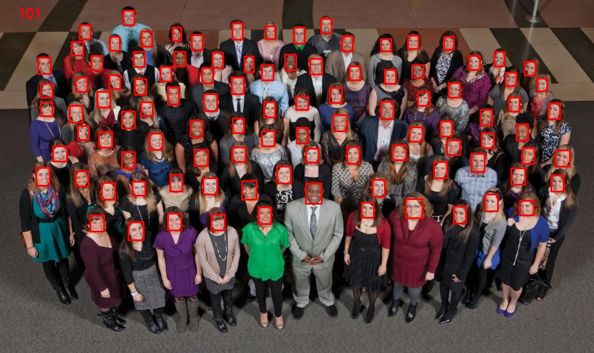

# Ultra-Light-Fast-Generic-Face-Detector-1MB 
# 超軽量の顔検出モデル

モデル設計は、**エッジコンピューティングデバイス**または**低電力デバイス**（ARM推論など）用に設計されたリアルタイムの超軽量ユニバーサル顔検出モデルです。リアルタイムの一般的なシーンの顔のARMなどの低電力コンピューティングデバイスで使用できます。検出推論は、モバイル端末とPCにも適用できます。

 - モデルサイズで、デフォルトのFP32の精度（.pth）ファイルサイズ**1.04〜1.1MB**、推論は、量子化INT8のフレームサイズである**300KB**程度。
 - モデルの計算では、320x240の入力解像度は約**90〜109 MFlops**です。
 - モデルには2つのバージョンがあります。バージョンスリム（わずかに高速化された単純化）、バージョンRFB（修正されたRFBモジュール、高精度）です。
 - 320x240および640x480の異なる入力解像度で、より広いフェーストレーニングを使用して事前トレーニングモデルを提供し、さまざまなアプリケーションシナリオでの動作を改善します。
 - onxxエクスポートのサポート。移植が容易な推論。


## 確認済み動作環境
- Ubuntu16.04、Ubuntu18.04、Windows 10（inference）
- Python3.6
- Pytorch1.2
- CUDA10.0 + CUDNN7.6

## 精度、速度、モデルサイズの比較
使用したトレーニングセット[Retinaface](https://github.com/deepinsight/insightface/blob/master/RetinaFace/README.md )は、 VOC widerfaceのトレーニングセットを生成するように設定データを提供widerfaceラベルのクリア（PSを：私は、次のテスト結果をテストし、その結果は、いくつかの矛盾を有していてもよいです）。
### Widerfaceテスト
 - WIDER FACE valセットのテスト精度（シングルスケール入力解像度：**320 * 240または最大辺長320によるスケーリング**）

モデル|Easy Set|Medium Set|Hard Set
------|--------|----------|--------
libfacedetection v1（caffe）|0.65 |0.5       |0.233
libfacedetection v2（caffe）|0.714 |0.585       |0.306
Retinaface-Mobilenet-0.25 (Mxnet)   |0.745|0.553|0.232
version-slim|0.765     |0.662       |0.385
version-RFB|**0.784**     |**0.688**       |**0.418**


- WIDER FACE valセットのテスト精度（シングルスケール入力解像度：**VGA 640 * 480または最大辺長640でスケーリング**）

モデル|Easy Set|Medium Set|Hard Set
------|--------|----------|--------
libfacedetection v1（caffe）|0.741 |0.683       |0.421
libfacedetection v2（caffe）|0.773 |0.718       |0.485
Retinaface-Mobilenet-0.25 (Mxnet)   |**0.879**|0.807|0.481
version-slim|0.757     |0.721       |0.511
version-RFB|0.851     |**0.81**       |**0.541**

> - この部分は、主にテストセットの効果を中および小の解像度でテストすることです。
> - RetinaFace-MNET（Retinaface-Mobilenet- 0.25）、 大きなワークから[insightface](https://github.com/deepinsight/insightface)、ネットワーク320に従って試験した場合、顔が変形しないように、ピクチャ又は比例スケール640の最大辺の長さである、固定サイズの残りのネットワークサイズを変更します。同時に、RetinaFace-mnetの最適な1600シングルスケールvalテストセットの結果は、0.887(Easy)/0.87(Medium)/0.791(Hard)です。


### 端末デバイスの推定速度

- Raspberry Pi 4B MNN推論テスト時間**（ミリ秒）**（ARM / A72x4 / 1.5GHz /入力解像度：**320x240** / int8量子化）

モデル|1コア|2コア|3コア|4コア
------|--------|----------|--------|--------
libfacedetection v1|**28**    |**16**|**12**|9.7
公式 Retinaface-Mobilenet-0.25 (Mxnet)   |46|25|18.5|15
version-slim|29     |**16**       |**12**|**9.5**
version-RFB|35     |19.6       |14.8| 11


### モデルサイズの比較
- いくつかのオープンソース軽量顔検出モデルのサイズの比較：

モデル|モデルファイルサイズ（MB）
------|--------
libfacedetection v1（caffe）| 2.58
libfacedetection v2（caffe）| 3.34
公式 Retinaface-Mobilenet-0.25 (Mxnet) | 1.68
version-slim| **1.04**
version-RFB| **1.11** 

## VOC形式のトレーニングデータセットとトレーニングプロセスを生成する

1. widefaceの公式Webサイトデータセットをダウンロードするか、提供したトレーニングセットをダウンロードして、./dataフォルダーに保存します。

  （1）10px * 10px面の後にきれいなwidefaceデータ圧縮パッケージを除外する：[Baidu cloud disk (extraction code: cbiu)](https://pan.baidu.com/s/1MR0ZOKHUP_ArILjbAn03sw)、[Google Drive](https://drive.google.com/open?id=1OBY-Pk5hkcVBX1dRBOeLI4e4OCvqJRnH )
  
  （2）フィルタリングされていない小さな顔用の完全なワイドフェイスデータ圧縮パッケージ：[Baidu cloud disk (extraction code: ievk)](https://pan.baidu.com/s/1faHNz9ZrtEmr_yw48GW7ZA)、[Google Drive](https://drive.google.com/open?id=1sbBrDRgctEkymIpCh1OZBrU5qBS-SnCP )
  
2. **（PS：上記の（1）でフィルター処理されたパケットをダウンロードする場合、この手順を実行する必要はありません。）** widefaceには多くの小さくて不明瞭な面があるため、効率的なモデルの収束を助長しないため、フィルター処理する必要があります。トレーニング。デフォルトでは、10ピクセルx 10ピクセルの顔サイズをフィルタリングします。./data/wider_face_2_voc_add_landmark.pyを実行します

```Python
 python3 ./data/wider_face_2_voc_add_landmark.py
```
実行が完了した後、ディレクトリ./dataで**wider_face_add_lm_10_10**が次のようなフォルダ、ディレクトリ構造で構築される。
```Shell
  data/
    retinaface_labels/
      test/
      train/
      val/
    wider_face/
      WIDER_test/
      WIDER_train/
      WIDER_val/
    wider_face_add_lm_10_10/
      Annotations/
      ImageSets/
      JPEGImages/
    wider_face_2_voc_add_landmark.py
```

3. この時点で、VOCトレーニングセットの準備ができています。プロジェクトのルートディレクトリには**train_mb_tiny_fd.sh**と**train_mb_tiny_RFB_fd.sh**の 2つのスクリプトがあります。前者はスリムバージョンモデルのトレーニングに使用され、後者は**RFB**バージョンモデルのトレーニングに使用されます。デフォルトのパラメーターが設定されています。微調整については、**./train.py**の各トレーニングハイパーパラメーターの説明を参照してください。

4. **train_mb_tiny_fd.sh**あるいは**train_mb_tiny_RFB_fd.sh**を実行します。
```Shell
sh train_mb_tiny_fd.sh または sh train_mb_tiny_RFB_fd.sh
```

## 画像効果の検出（入力解像度：**640x480**）


## PS

 - 実際の制作シーンが中距離、大顔、少数の顔である場合、入力サイズinput_size：320（320x240）解像度のトレーニングを使用し、提供された事前トレーニングモデルの使用など、予測推論のために320x240の画像サイズ入力を使用することをお勧めします推論のための**Mb_Tiny_RFB_FD_train_input_320.pth**。
 - 実際の制作シーンが中距離から長距離、小さな顔、多数の顔の場合、次のことが推奨されます。
 
 （1）最適：入力サイズinput_size：640（640x480）解像度のトレーニング、および提供される事前トレーニングモデル**Mb_Tiny_RFB_FD_train_input_640.pth**を推論に使用するなど、予測推論に同じまたはより大きい入力サイズを使用し、誤検知を減らします。
 
 （2）準最適：入力サイズinput_size：320（320x240）解像度のトレーニング。予測推論のために480x360または640x480サイズの入力を使用し、小さな顔により敏感で、誤検出が増加します。
 
 - 各シーンに最適な結果を得るには、入力解像度を調整して速度と精度のバランスをとる必要があります。
 - 入力解像度が高すぎると、小さな顔のリコール率が向上しますが、大規模で近距離の顔の偽陽性率も増加し、推論の速度は指数関数的に増加します。
 - 入力解像度が小さすぎると、推論が大幅に高速化されますが、小さな顔のリコール率が大幅に低下します。
 - プロダクションシーンの入力解像度は、モデルトレーニングの入力解像度と可能な限り一致している必要があり、上下のフロートは大きすぎてはなりません。

## TODO LIST

 - widefaceテストコードに参加
 - いくつかのテストデータを改善する
 - MNN、NCNN C ++推論コードの追加
 
##  Reference
 - [pytorch-ssd](https://github.com/qfgaohao/pytorch-ssd)
 - [libfacedetection](https://github.com/ShiqiYu/libfacedetection/)
 - [RFBNet](https://github.com/ruinmessi/RFBNet)
 - [RFSong-779](https://github.com/songwsx/RFSong-779)
 - [Retinaface](https://github.com/deepinsight/insightface/blob/master/RetinaFace/README.md)
